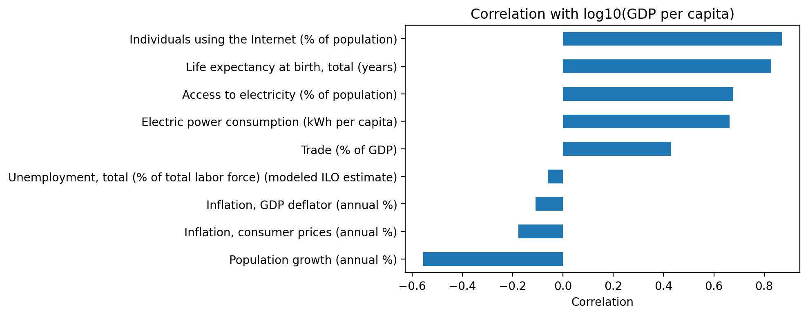
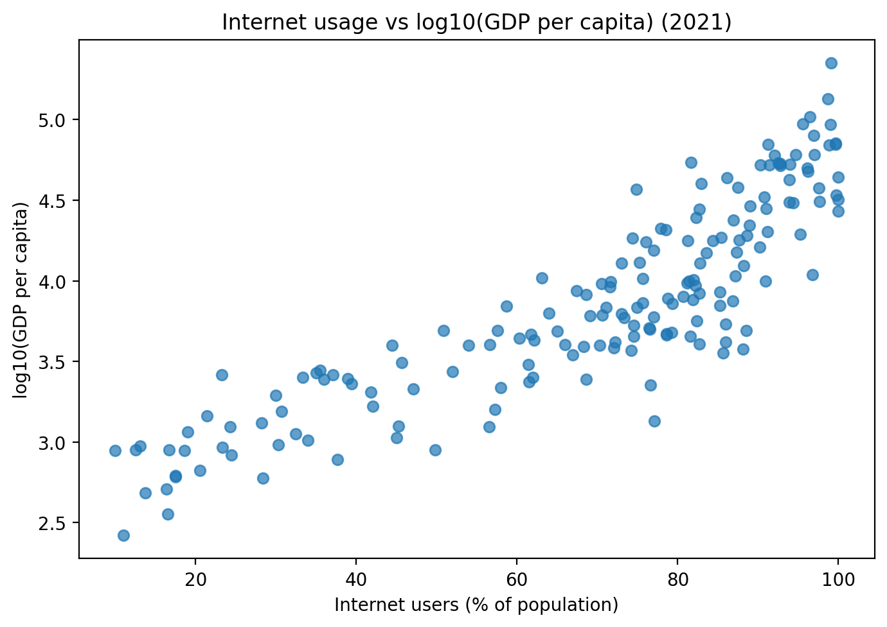
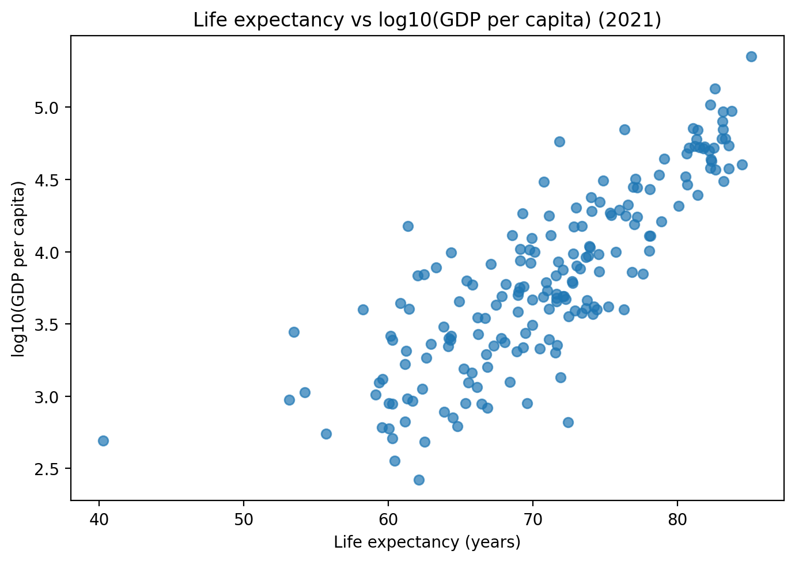
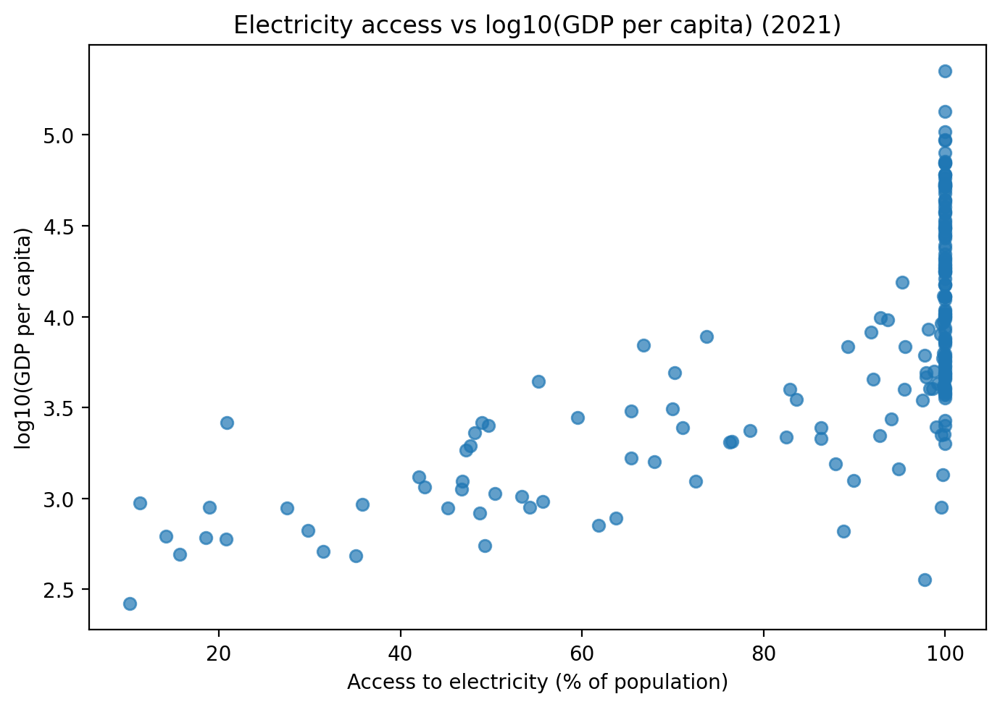
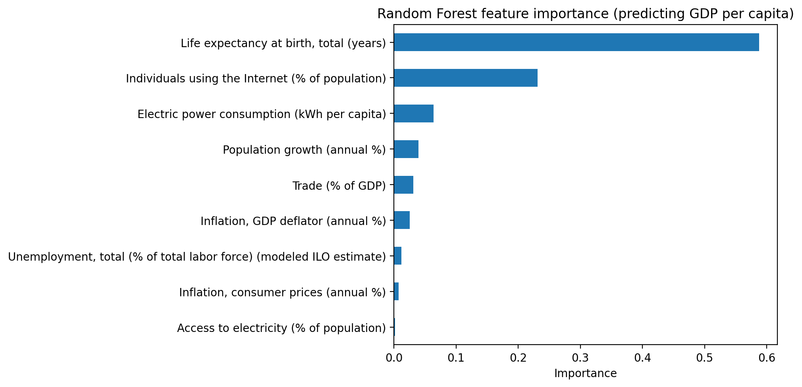

# What Drives GDP per Capita? A World Bank Data Analysis (2021)

Economic prosperity varies widely across countries. Using **2021 World Bank development indicators**, this analysis examines **which factors are most strongly associated with GDP per capita** and whether these indicators can be used to **predict income levels across countries**.

---

## Data and Analytical Approach

The dataset consists of country-level development indicators for the year 2021, covering dimensions such as health, digital access, energy consumption, inflation, trade, and labor markets. The data were cleaned and reshaped into a wide format (one row per country). Indicators with excessive missing values were removed, and countries with extremely sparse data coverage were excluded.

The analysis follows the **CRISP-DM framework**, combining exploratory data analysis with regression modeling.

---

## Modeling GDP per Capita

Two models were trained to predict GDP per capita from the remaining indicators:

- **Linear Regression** as a baseline model  
- **Random Forest Regressor** to capture non-linear relationships and interactions  

The Random Forest model performed substantially better, achieving higher explanatory power and lower prediction accuracy errors. This suggests that economic development is influenced by complex, non-linear interactions among indicators rather than simple linear effects.

---

## Results

### Question 1: Which development indicators are most strongly associated with GDP per capita?

**Hypothesis:** Countries with stronger health outcomes and greater digital access tend to have higher GDP per capita.

**Evidence:** The correlation bar chart shows strong positive correlations between log10(GDP per capita) and **internet usage** as well as **life expectancy**, while **population growth** and **inflation** exhibit negative correlations.

**Interpretation:** These correlations support the hypothesis, indicating that health and digital connectivity are closely associated with higher income levels across countries.

---

### Question 2: How does internet usage relate to GDP per capita?

**Hypothesis:** Higher internet penetration is associated with higher GDP per capita.

**Evidence:** The scatter plot shows a clear upward trend, with countries that have higher internet usage generally exhibiting higher log-transformed GDP per capita.

**Interpretation:** The visual supports the hypothesis, demonstrating a strong positive association between digital connectivity and economic prosperity.

---

### Question 3: How does life expectancy relate to GDP per capita?

**Hypothesis:** Countries with higher life expectancy tend to have higher GDP per capita.

**Evidence:** The scatter plot reveals a strong positive relationship between life expectancy and log10(GDP per capita), with relatively tight clustering around an upward trend.

**Interpretation:** This visual strongly supports the hypothesis, highlighting the close link between population health outcomes and economic development.

---

### Question 4: What is the relationship between electricity access and GDP per capita?

**Hypothesis:** Greater access to electricity is associated with higher GDP per capita, but with diminishing returns once access becomes nearly universal.

**Evidence:** The scatter plot shows many countries clustered near universal electricity access, with income gains flattening at high access levels.

**Interpretation:** The visual partially supports the hypothesis, indicating a positive but non-linear relationship and a clear saturation effect.

---

### Question 5: Which indicators are most important for predicting GDP per capita?

**Hypothesis:** Health, digital access, and energy consumption are among the most important predictors of GDP per capita.

**Evidence:** Feature importance scores from the Random Forest model rank **life expectancy**, **internet usage**, and **electric power consumption** as the most influential predictors.

**Interpretation:** These results support the hypothesis and emphasize the dominant role of health, connectivity, and energy use in explaining income variation across countries.

---

## Key Takeaways

- Health and access-related indicators are consistently associated with higher GDP per capita.  
- Internet usage and life expectancy emerge as the strongest correlates of income levels.  
- Non-linear models better capture the complexity of economic development than linear approaches.  
- Digital connectivity and infrastructure remain central to modern economic prosperity.

---

## Limitations

This analysis relies on a **single-year (2021) cross-sectional snapshot**, which limits causal interpretation and temporal inference. Country-level averages mask within-country inequality and regional variation. Additionally, some indicators exhibit skewness and outliers despite careful preprocessing.

---

**Data source:** World Bank World Development Indicators (2021)
